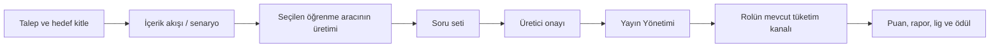

# Öğrenim Aracı Genişletme Projesi Planı

**Proje:** Öğrenme Araçları Genişletmesi  
**Plan tarihi:** 27 Ağustos 2026  
**Kapsam:** Podcast, Flip PDF / Dijital İnteraktif Broşür ve Görsel  
**Kaynak:** AI Öğrenme Aşamasında incelenen mevcut video üretim ve tüketim zinciri

## Bağlayıcı Proje Kararları

1. Mevcut üretim ve tüketim süreçleri yeniden tasarlanmayacaktır; yeni öğrenme araçları mevcut omurgaya eklenecektir.
2. V1–V4 üretim varyantları korunacaktır. Öğrenme aracı seçimi varyant değildir.
3. Her talep tek bir öğrenme aracı seçer: video, podcast, flip PDF veya görsel.
4. Aynı eğitim konusu farklı öğrenme araçlarıyla yayımlanırsa her yayın bağımsız bir öğrenme ve kazanım fırsatıdır. İçerik benzerliği puanı engellemez; otomatik benzerlik veya mükerrer içerik denetimi yapılmaz.
5. Mevcut hedef rol, soru, puan, öneri, challenge, dağıtım, rapor, lig ve ödül kuralları korunur.
6. Bütün öğrenme araçları Bunny altyapısında tutulur:
   - Video: Bunny Stream
   - Podcast, flip PDF ve görsel: Bunny Storage Zone + Pull Zone/CDN
7. Medya dosyaları repoya veya Vercel deployment paketine eklenmez.
8. Ortak teknik omurga bir kez kurulur; araçlar **Podcast → Görsel → Flip PDF** sırasıyla uçtan uca tamamlanır. Bir araç üretimden beş tüketici rolündeki canlı doğrulamaya kadar bitmeden sonraki araca geçilmez.

---

## 1. Değişmeyecek Ana Kuralların Kod Sözleşmesine Dönüştürülmesi

Öğrenme aracı türü için tek doğruluk kaynağı oluşturulur:

```text
video | podcast | flip_pdf | gorsel
```

Bu sözleşme talep formu, üretim görevi, onay, yayın, tüketim ve rapor katmanlarında aynı değerleri kullanır. Rol ve hedef kitle sözleşmeleri `lib/utils/roller.ts`, eğitim/içerik türleri ise `lib/uretici/yetenekler.ts` kaynaklarından gelmeye devam eder.

Her `yayin_id` bağımsız öğrenme fırsatıdır. Aynı eğitim ailesindeki farklı araçlar gerekirse mevcut `egitim_id` üzerinden raporda gruplanabilir; bu bağ puan tekilliği veya puan engeli oluşturmaz.

**Tamamlanma ölçütü:** Araç türleri, hedef roller, bağımsız yayın ve bağımsız puan ilkeleri kod ve veritabanında tekil sözleşmelerle tanımlanmış olmalıdır.

---

## 2. V1–V4 Üretim Varyantlarının Araçtan Bağımsızlaştırılması

| Varyant | Öğrenme aracı | Soru seti | Süreç |
|---|---|---|---|
| V1 | HapBilgi üretir | HapBilgi üretir | Tam üretim |
| V2 | Üretici hazır sağlar | HapBilgi üretir | Hazır araç, soru üretimi |
| V3 | HapBilgi üretir | Üretici hazır sağlar | Araç üretimi, hazır soru |
| V4 | Üretici hazır sağlar | Üretici hazır sağlar | Doğrudan Yayın Yönetimi |

Mevcut `hazir_video` kavramı kullanıcı tarafında **hazır öğrenme aracı** olarak genelleştirilir. Eski video talepleri geriye dönük olarak `video` türü kabul edilir.

Üretim sırası korunur:



Podcast senaryosu konuşma metnini; flip PDF ve görsel senaryosu metin, görsel hiyerarşi ve içerik akışını ifade eder. Yeni bir onay zinciri açılmaz.

**Tamamlanma ölçütü:** Dört varyant, dört araç türüyle aynı karar motorundan hesaplanabilmelidir.

---

## 3. Veri Modelinin Genelleştirilmesi

### 3.1. `ogrenme_araclari`

Yeni ana tablo en az şu alanları taşır:

| Alan | Amaç |
|---|---|
| `arac_id` | Öğrenme aracı kimliği |
| `talep_id` | Talep bağlantısı |
| `senaryo_durum_id` | İçerik/senaryo onay bağlantısı |
| `iu_id` | Üretimi yapan İçerik Üreticisi |
| `arac_turu` | `video`, `podcast`, `flip_pdf`, `gorsel` |
| `kaynak` | `iu` veya `hazir` |
| `dosya_yolu` | Bunny nesne yolu veya Stream kimliği |
| `kapak_yolu` | Kart kapağı |
| `mime_type` | Doğrulanmış dosya türü |
| `dosya_boyutu` | Byte büyüklüğü |
| `checksum_sha256` | Dosya bütünlüğü |
| `sure_saniye` | Video ve podcast süresi |
| `sayfa_sayisi` | Flip PDF sayfa sayısı |
| `genislik`, `yukseklik` | Görsel ölçüleri |
| `metadata` | Araç türüne göre doğrulanan JSON metadata |
| `created_at` | Oluşturulma tarihi |

Kalıcı, yetkisiz erişime açık bir medya URL'si temel kimlik olarak tutulmaz. Veritabanı Bunny Stream kimliğini veya Storage nesne yolunu saklar; tüketim URL'si erişim anında üretilir.

### 3.2. Durum ve puan

- `ogrenme_araci_durumu`, mevcut `video_durumu` durum geçmişinin araçtan bağımsız karşılığı olur.
- `ogrenme_araci_puanlari`, mevcut `video_puanlari` kavramını araçtan bağımsızlaştırır.
- Kullanıcı arayüzündeki ad **Öğrenme Aracı Puanı** olur.

### 3.3. Mevcut bağlantılar

- `talepler` tablosuna `ogrenme_araci_turu` eklenir.
- `soru_setleri` tablosuna `arac_durum_id` eklenir.
- `yayin_yonetimi` tablosuna doğrudan `arac_durum_id` eklenir.
- `uretim_gorevleri` tablosuna `arac_id` eklenir.
- `v_yayin_detay`, araç türünü ve araca özel doğrulanmış metadata alanlarını döndürür.

### 3.4. Video uyumluluğu

1. Yeni tablolar eklemeli migration ile kurulur.
2. Eski videolar `arac_turu=video` olarak geri doldurulur.
3. `video_id` ve `video_durum_id` uyumluluk süresince korunur.
4. Görünümler eski ve yeni kayıtları ortak yayın sözleşmesiyle sunar.
5. Video regresyonu doğrulanmadan eski bağlantılar kaldırılmaz.

**Tamamlanma ölçütü:** Mevcut video yayınları davranış değiştirmeden yeni araç modelinden okunabilmelidir.

---

## 4. Dosya Yükleme, Bunny Depolama ve Medya Güvenliği

### 4.1. Ortak yükleme motoru

Önerilen API sözleşmesi:

- `POST /api/ogrenme-araclari/yukleme-baslat`
- `POST /api/ogrenme-araclari/yukleme-tamamla`
- `GET /api/ogrenme-araclari/[arac_id]/durum`
- `GET /api/ogrenme-araclari/[arac_id]/erisim`

İstemcinin uzantı beyanına güvenilmez. MIME türü, dosya imzası, boyut ve metadata sunucuda doğrulanır. Dosya yolu istemci tarafından seçilmez. Yükleme tamamlanmadan onaylanmış araç kaydı oluşmaz.

### 4.2. Bunny depolama kararı

| Araç | Depolama ve dağıtım |
|---|---|
| Video | Mevcut Bunny Stream kütüphanesi ve TUS yükleme hattı |
| Podcast | Bunny Storage Zone + Pull Zone/CDN |
| Flip PDF | Bunny Storage Zone + Pull Zone/CDN |
| Görsel | Bunny Storage Zone + Pull Zone/CDN |

Podcast, PDF ve görseller için aynı Bunny hesabında ayrı bir **HapBilgi Öğrenme Araçları Storage Zone** ve buna bağlı Pull Zone kurulur. Storage erişim anahtarı istemciye verilmez. Mevcut Bunny Stream TUS imzalama yöntemi Storage için otomatik olarak yeniden kullanılmış kabul edilmez; güvenli yükleme yetkilendirmesi ayrı geliştirilir.

Tüketim erişimi, rol ve yayın kapısı doğrulandıktan sonra süreli/tokenlı CDN adresiyle sağlanır. Dosyalar repo, Next.js `public` klasörü veya Vercel deployment çıktısına girmez.

### 4.3. Araç doğrulamaları

**Podcast**

- İlk sürümde MP3 ve M4A/AAC kabul edilir.
- Pozitif süre zorunludur.
- Monolog/diyalog bilgisi metadata olarak tutulur; ayrı araç türü değildir.
- Kapak ve transkript üretim tesliminin parçasıdır.
- Vercel üzerinde ses dönüştürme yapılmaz; nihai dosya yüklenir.

**Flip PDF**

- Bozuk veya şifreli PDF reddedilir.
- Sayfa sayısı en az bir olmalıdır.
- PDF doğrudan tarayıcı eklentisine bırakılmaz; `pdfjs-dist` ile kontrollü biçimde işlenir.
- Kapak ilk sayfadan veya ayrı kapak dosyasından üretilir.

**Görsel**

- JPEG/JPG, PNG ve ayrıca kararlaştırılan güvenli raster türleri kabul edilir.
- Gerçek MIME türü ve piksel ölçüsü doğrulanır.
- EXIF ve gereksiz metadata temizlenir.
- İlk sürümde bir yayın bir ana görsel taşır; çok görselli galeri bu projenin kapsamında değildir.

**Tamamlanma ölçütü:** Her araç güvenli biçimde Bunny'ye yüklenmeli, doğrulanmalı ve yetkisiz kalıcı URL açığa çıkmadan gösterilmelidir.

---

## 5. Talep Oluşturma Ekranının Genişletilmesi

Talep formuna zorunlu **Öğrenme Aracı** seçimi eklenir. Seçim talep gönderildiğinde donar.

- Video: mevcut TUS yükleme alanı
- Podcast: ses, kapak, monolog/diyalog ve transkript
- Flip PDF: PDF yükleme ve ön izleme
- Görsel: görsel yükleme ve ön izleme

Varyant hesabı yalnız şu iki sorudan yapılır:

1. Öğrenme aracı hazır mı?
2. Soru seti hazır mı?

Hedef kitle, eğitim türü, ürün, teknik, soru seti büyüklüğü, seçenek sayısı ve gösterilecek soru sayısı kuralları korunur. Hazır dosya alanı referans dosyası alanından ayrı kalır.

**Tamamlanma ölçütü:** Üretici dört araçtan birini seçerek V1–V4 talebi oluşturabilmeli; sunucu istemci seçimini ve rol yetkisini yeniden doğrulamalıdır.

---

## 6. İçerik Üreticisi Çalışma Alanının Genişletilmesi

Mevcut görev motoru ve durum makinesi korunur. Araç üretim alanı seçilen türe göre değişir:

- Video: mevcut üretim ve Bunny Stream yüklemesi
- Podcast: nihai ses, kapak ve transkript teslimi
- Flip PDF: nihai PDF, sayfa sayısı ve ön izleme
- Görsel: nihai görsel, ölçü ve okunabilirlik ön izlemesi

İçerik Üreticisi mevcut onay/revizyon akışını kullanır. Sabit “Video” ifadeleri araç türüne göre sunulur; yeni görev aşaması açılmaz. V1 ve V3 araç üretimi ister; V2 ve V4 hazır aracı kullanır.

Bu proje tarayıcı içinde ses kayıt/montaj stüdyosu veya broşür tasarım programı kurmaz. İçerik Üreticisi nihai dosyayı üretim hizmetinin çıktısı olarak yükler; HapBilgi talep, görev, onay ve teslim zincirini yönetir.

**Tamamlanma ölçütü:** İçerik Üreticisi seçilen aracı mevcut görev yaşam döngüsü içinde teslim edebilmeli; üretici ön izleyip onaylayabilmelidir.

---

## 7. Yayın Yönetiminin Araçtan Bağımsızlaştırılması

Ortak yayın kapıları:

- Öğrenme aracı onaylı olmalı.
- Araç metadata'sı doğrulanmış olmalı.
- Soru seti onaylı ve boş olmamalı.
- Bütün soruların puanı tanımlanmış olmalı.
- Öğrenme Aracı Puanı tanımlanmış olmalı.
- Hedef roller talepten gelmeli.
- Planlanan yayın ve Tur 1 davranışı korunmalı.

Araç bazlı ek kapılar:

| Araç | Yayın kapısı |
|---|---|
| Video | Hazır encode ve pozitif süre |
| Podcast | Pozitif süre ve oynatılabilir ses |
| Flip PDF | Geçerli PDF ve pozitif sayfa sayısı |
| Görsel | Geçerli ölçüler ve yüklenebilir görsel |

Eczanem için barkod ve puan/TL karşılığı zorunlu kalır. E-Club ve Eczanem hedeflerinde extra puan bulunmaz. Araç türü yayın aşamasında değiştirilemez.

**Tamamlanma ölçütü:** Yayın Yönetimi dört araç için aynı onay ve planlama sürecini işletmeli; eksik araç metadata'sı olan yayın açılamamalıdır.

---

## 8. Ortak Tüketim Çekirdeğinin Kurulması

T-Club, C-Club, E-Club ve Eczanem tek bir rol motorunda birleştirilmez; erişim ve puan sözleşmeleri farklı kalır. Bunların altında ortak öğrenme aracı katmanı kurulur:

```text
OgrenmeAraciSunucusu
├── VideoAraci
├── PodcastAraci
├── FlipPdfAraci
└── GorselAraci
```

Her araç şu ortak davranışları sağlar:

- `baslat`
- `ilerlemeKaydet`
- `tamamlanabilirMi`
- `tamamla`
- `soruHakkiKaniti`
- `kaldigiYerdenDevam`
- `kapakVeMetadata`

Rol motorları şunları belirlemeye devam eder:

- doğrudan erişim veya öneri/challenge/gönderim bağı,
- puanlı zaman,
- yanlış cevap davranışı,
- tekrar ve extra puan,
- lig ve ödül defteri.

Mevcut rol bazlı izleme tablolarına `arac_turu`, `ilerleme_durumu` ve `tamamlama_kaniti` eklenir. Puan ve rapor geçmişinin kökü olan mevcut tablolar ilk sürümde korunur. Kullanıcı arayüzü ve yeni kod “öğrenme/tamamlama puanı” dilini kullanırken eski `puan_turu='izleme'` kayıtları uyumluluk amacıyla korunabilir.

**Tamamlanma ölçütü:** Aynı yayın erişim ve puan motoru, araç türüne uygun tamamlanma kanıtını ortak katmandan alabilmelidir.

---

## 9. Araç Bazlı Tamamlanma Kurallarının Uygulanması

### 9.1. Podcast

- İlk gerçek Play ile oturum açılır.
- Süre ve son konum kaydedilir.
- UTT, BM ve E-Club'da ileri atlama mevcut video kuralına göre oransal kayıp üretir ve soru hakkını kapatır.
- Eczanem'de ileri atlama kapalıdır.
- Arka sekmede sahte ilerleme yazılmaz.
- Tamamlanma sesin sonuna ulaşma ve sunucu süre kontrolüyle doğrulanır.
- İlk sürümde oynatma hızı değiştirme kapalıdır.

### 9.2. Görsel

- Görsel tamamen yüklenmiş ve görünür olmalıdır.
- Arka sekmede geçen süre sayılmaz.
- Yayına sabitlenmiş asgari aktif inceleme süresi dolmalıdır.
- Süre dolduktan sonra kullanıcı “İncelemeyi tamamladım” eylemini verir.
- Tamamlanma koşulu oluşmadan sorular açılmaz.

### 9.3. Flip PDF / Dijital İnteraktif Broşür

- Masaüstünde çift, mobilde tek sayfa düzeni
- Sayfa çevirme
- Yakınlaştırma
- Küçük sayfa ön izlemeleri
- Tam ekran
- Kaldığı sayfadan devam

Tamamlanma için bütün zorunlu sayfalar açılmış ve sayfa görünürken gerekli aktif okuma süresi oluşmuş olmalıdır. Son sayfaya hızlı geçiş tamamlanma sayılmaz. Atlanan sayfa daha sonra okunabilir; doğrudan puan kaybı yazılmaz. Bütün sayfa koşulları tamamlanmadan sorular açılmaz.

Tamamlanma kuralı oturum başında snapshot olarak saklanır; yayın metadata'sı sonradan değişse bile başlamış oturumun kuralı değişmez.

**Tamamlanma ölçütü:** Her araç, kendi yapısına uygun ve sunucuda doğrulanabilir tamamlanma kanıtı üretmelidir.

---

## 10. Rol Kurallarının Bütün Araçlara Uygulanması

| Kural | UTT/KD_UTT | BM | Eczacı/teknisyen | Müşteri |
|---|---:|---:|---:|---:|
| Doğrudan katalog | Var | Var | Yok | Yok |
| Yönlendirme bağı | BM önerisi | Challenge | UTT önerisi | Eczane gönderimi |
| Doğru cevap puanı | Var | Var | Var | Var |
| Yanlış cevap kaybı | Var | Var | Yok | Yok |
| Extra puan | 3. temiz tekrar | 2. temiz tekrar | Yok | Yok |
| Ödül kanalı | HBStore | HBStore | E-Club Store | Eczane indirimi |

Bu sözleşme video, podcast, flip PDF ve görsel için aynıdır. Araçların tamamlanma yöntemi farklı, tamamlanma sonrasındaki rol ekonomisi aynıdır.

E-Club önerisinin süresi geçmişse araç tüketilebilir ancak puan ve soru üretmez. Eczanem gönderimi aktif müşteri-eczane üyeliğine bağlı kalır. UTT puanlı zaman penceresi değişmez. C-Club challenge yaşam döngüsü, projeye başlamadan önce kayıtlı U-05 ve U-06 uyumsuzlukları için alınacak kararla tek sözleşmeye bağlanır.

**Tamamlanma ölçütü:** Beş tüketici rolü, üç yeni aracı kendi mevcut erişim, puan ve ödül sözleşmesiyle kullanabilmelidir.

---

## 11. Rapor, Lig, Bildirim ve Hapbi Uyarlaması

Rapor kaynaklarına `arac_turu` eklenir. Aşağıdaki kırılımlar üretilebilir:

- araç türüne göre erişim ve tamamlanma,
- doğru cevap başarısı,
- araç ve soru puanı,
- öneri/challenge/dağıtım performansı,
- aynı eğitim ailesindeki farklı araçların ayrı sonuçları.

Lig toplamı araç türüne göre bölünmez; bütün öğrenme davranışları mevcut net puana katılır. Mağaza ve Eczanem FIFO/kasa ekonomisi aynı puan defterlerinden beslenir.

Bildirim ve arayüz dili “yeni video” yerine araç türünü veya genel olarak “yeni öğrenme yayını” ifadesini kullanır. Beğeni ve favori davranışı bütün araçlarda korunur.

Hapbi kaynağına araç türü, başlık, tamamlanma durumu, doğru cevap başarısı ve role uygun yayın bağlantısı eklenir. Hapbi kullanıcıyı doğru araç oynatıcısına yönlendirir.

**Tamamlanma ölçütü:** Yeni araçlardan gelen davranışlar mevcut rapor, lig, mağaza, bildirim ve Hapbi kaynaklarında eksiksiz görünmelidir.

---

## 12. Uygulama ve Yayına Alma Sırası

### 12.1. Ortak omurga

- Araç türü sözleşmesi
- Yeni tablolar ve eklemeli migration
- Video geri doldurma ve uyumluluk görünümü
- Bunny Storage Zone + Pull Zone bağlantısı
- Ortak yükleme, erişim ve tüketim katmanı
- Mevcut video regresyonu

### 12.2. Podcast dikey geliştirmesi

Podcast süreli tüketim bakımından videoya en yakın araç olduğu için ilk geliştirilir:

1. Talep ve V1–V4
2. İçerik Üreticisi teslimi
3. Üretici onayı
4. Yayın Yönetimi
5. UTT/KD_UTT
6. BM
7. Eczacı ve teknisyen
8. Müşteri
9. Rapor, puan, lig ve ödül
10. Canlı rol doğrulaması

Podcast tamamen kapanmadan görsele geçilmez.

### 12.3. Görsel dikey geliştirmesi

Podcastte doğrulanan ortak omurga kullanılarak görsel üretimden beş tüketici rolüne kadar tamamlanır. Aktif inceleme süresi ve açık tamamlanma eylemi ayrıca doğrulanır.

Görsel tamamen kapanmadan flip PDF'ye geçilmez.

### 12.4. Flip PDF dikey geliştirmesi

Son aşamada PDF.js görüntüleyici, sayfa takibi, mobil/masaüstü düzeni ve sayfa bazlı tamamlanma kanıtı eklenir. Üretimden beş tüketici rolüne kadar tamamlanır.

### 12.5. Birleştirme

- Rapor filtreleri
- Hapbi kaynakları
- Bildirim dili
- Beğeni/favori
- Lig ve mağaza mutabakatı
- Bluebook ve proje dokümanı güncellemesi

**Tamamlanma ölçütü:** Her dikey geliştirme kendi başına üretilebilir, yayımlanabilir, tüketilebilir, ölçülebilir ve ödüllendirilebilir durumda kapanmalıdır.

---

## 13. Test, Kabul ve Geri Dönüş Planı

### 13.1. Üretim matrisi

Üç yeni araç × dört varyant = **12 üretim senaryosu** ayrı ayrı doğrulanır.

Her senaryoda:

- doğru ilk görev,
- hazır araç ve hazır soru ayrımı,
- İçerik Üreticisi ataması,
- onay/revizyon,
- Yayın Yönetimine geçiş,
- yetki ve sahiplik

kontrol edilir.

### 13.2. Tüketim matrisi

Üç yeni araç şu beş rolle doğrulanır:

- UTT/KD_UTT
- BM
- Eczacı
- Eczane teknisyeni
- Müşteri

En az **15 temel tüketim senaryosu**; ayrıca öneri, challenge, süre aşımı, yarım bırakma, tekrar, yanlış cevap, aktif üyelik ve mükerrer tamamlama sınırları test edilir.

### 13.3. Zorunlu regresyon

- Mevcut video testlerinin tamamı geçmelidir.
- Eski video yayınları davranış değişmeden açılmalıdır.
- Aynı tamamlama iki kez puan yazmamalıdır.
- Başka firma, takım, bölge, eczane veya kişiye ait yayın açılamamalıdır.
- Puanlar mevcut rapor, lig ve ödül bakiyelerine doğru yansımalıdır.
- Medya dosyaları Vercel deployment boyutuna girmemelidir.
- PDF motoru dinamik yüklenmeli ve ilk sayfa paketini gereksiz büyütmemelidir.
- Mobilde podcast arka plan davranışı, PDF bellek tüketimi ve büyük görsel yüklemesi ölçülmelidir.

### 13.4. Geri dönüş güvenliği

- Şema değişiklikleri ilk aşamada eklemeli yapılır.
- Her araç firma veya sistem bayrağıyla ayrı açılıp kapatılabilir.
- Podcast, görsel veya flip PDF kapatıldığında mevcut video akışı etkilenmez.
- Puan yazan migration ve RPC değişiklikleri idempotent ve geri dönüşü tanımlı olmadan canlıya alınmaz.
- Bir araç dikey geliştirmesi başarısız olursa sonraki araç başlamaz; ortak omurga ve tamamlanan önceki araç çalışmaya devam eder.

**Proje kabulü:** Podcast, görsel ve flip PDF; V1–V4 üretim, onay, yayın, beş tüketici rolündeki kullanım, soru, puan, rapor, lig ve ödül zincirlerinin tamamında doğrulanmış olmalıdır. Mevcut video sistemi aynı kontroller altında kesintisiz çalışmaya devam etmelidir.
